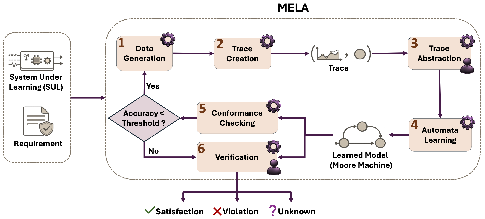
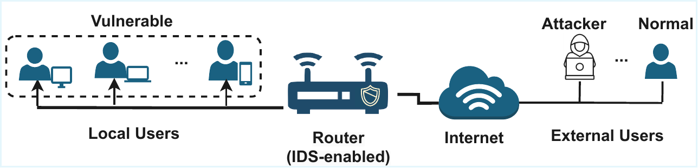
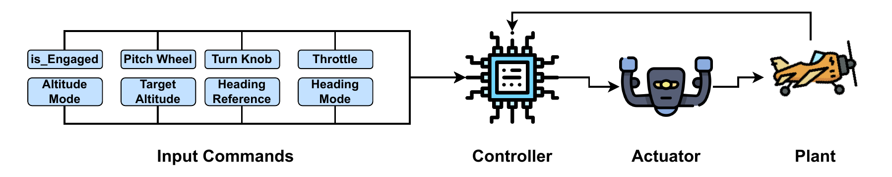

# CPS Behavioural Model Synthesis with MELA

This repository contains the implementation, data, learned models, and verification artifacts for **MELA**, a machine-learning-enhanced passive automata-learning approach for cyber-physical systems (CPS) with numeric time-series inputs and outputs.

MELA transforms numeric execution traces into symbolic traces with supervised trace abstraction, then learns Moore state machines from the abstract traces. The learned models can be checked for conformance with held-out traces and analyzed with NuSMV for requirement verification and behaviour exploration.


## Overview



MELA has six main steps:

1. **Data generation**: execute the system under learning and collect time-series data.
2. **Trace creation**: sample time-series inputs and outputs into finite traces.
3. **Trace abstraction**: select relevant variables and map numeric values to symbolic ranges.
4. **Automata learning**: learn Moore state machines from abstract traces with passive automata learning.
5. **Conformance checking**: evaluate learned models against test traces.
6. **Verification**: check temporal properties over the learned models with NuSMV.

## Case Studies

This repository contains artifacts for two CPS case studies.

### 1. Network Intrusion Detection System



The IDS case study models an IDS-enabled router developed by RabbitRun Technologies. The IDS observes network traffic and updates its state from flow-level features. The testbed represents local users, an IDS-enabled router, external users, normal traffic, DoS attacks, and DDoS attacks.

IDS states:

- `Safe`
- `Warning`
- `Tending Warning`
- `Tending Alert`
- `Alert`

Main IDS variables used in the experiments:

- `num_flows`: total number of flows through the router.
- `num_unreplied`: number of flows without replies from local users.
- `External User type`: normal user, DoS attacker, or DDoS attacker.

The reported IDS configurations are:

- `num_flows`
- `num_unreplied`
- `flow_unreplied`, which combines `num_flows` and `num_unreplied`

IDS learning sets:

- `DoS3`: DoS traces with three-state coverage.
- `DoS5`: DoS traces with five-state coverage.
- `DDoS`: DDoS traces with three-state coverage.

### IDS Testbed


The IDS testbed uses three virtual machines deployed on separate machines:

- A local-user VM with vulnerable hosts.
- A router VM with the IDS-enabled RabbitRun router.
- An external-user VM for normal traffic, DoS traffic, and DDoS traffic.

IDS testbed scripts are stored in:

```text
Testbed/IDS/
├── container.sh
├── hping.sh
└── hping_traffic.sh
```

The RabbitRun router implementation is proprietary and is not included in this repository.

### 2. Autopilot System



The autopilot case study uses a Simulink model of a De Havilland Beaver aircraft. The autopilot receives flight commands and adjusts the aircraft toward a target altitude.

Autopilot scenarios:

- `ascent`
- `descent`

Autopilot states:

- `Nominal`
- `Caution`
- `Critical`

Main autopilot variables used in the experiments:

- `PitchWheel`
- `Throttle`
- `PWheel_Throttle`, which combines `PitchWheel` and `Throttle`

The requirement-referenced input is `Target Altitude`, which is fixed by the scenario.

## Repository Structure

```text
CPS-Behavioural-Model-Synthesis/
├── Code/
│   ├── IDS/
│   └── Autopilot/
├── Data/
│   ├── IDS/
│   └── Autopilot/
├── Evalution/
│   ├── IDS/
│   └── Autopilot/
├── Figures/
│   ├── IDS/
│   └── Autopilot/
├── images/
├── Results/
│   ├── IDS/
│   └── Autopilot/
├── Testbed/
│   ├── IDS/
│   └── Autopilot-Simulink/
└── README.md
```


## Requirements

### Python

- [Python 3.8 or later](https://www.python.org/downloads/)
- [AALpy](https://des-lab.github.io/AALpy/)
- [scikit-learn](https://scikit-learn.org/stable/)
- [pandas](https://pandas.pydata.org/)
- [matplotlib](https://matplotlib.org/)
- [pydot](https://github.com/pydot/pydot)

Install the Python packages with:

```bash
python3 -m venv .venv
source .venv/bin/activate
pip install aalpy scikit-learn pandas matplotlib pydot
```

### Model Checking

- [NuSMV](https://nusmv.fbk.eu/)

NuSMV must be available from the command line for RQ2 model checking.

```bash
NuSMV -h
```

### IDS Testbed

The IDS testbed requires:

- [VirtualBox](https://www.virtualbox.org/)
- [Ubuntu](https://ubuntu.com/download)
- [Kali Linux](https://www.kali.org/)
- [hping3](https://www.kali.org/tools/hping3/)
- [Metasploitable](https://docs.rapid7.com/metasploit/metasploitable-2/)

### Autopilot Testbed

The autopilot case study requires:

- [MATLAB](https://www.mathworks.com/products/matlab.html)
- [Simulink](https://www.mathworks.com/products/simulink.html)

## Data and Artifacts

### IDS

```text
Data/IDS/
├── Input/
├── Output/
├── Learning set/
├── Abstraction/
└── Trace/

Results/IDS/
├── LearnedModel/
├── RQ1/
└── RQ2/

Evalution/IDS/
├── RQ1/
└── RQ2/
```

- `Data/IDS/Input`: IDS input data used for trace construction.
- `Data/IDS/Output`: IDS output data.
- `Data/IDS/Learning set`: learning sets used for automata learning.
- `Data/IDS/Abstraction`: abstracted data from MELA and BASELINE.
- `Data/IDS/Trace`: symbolic traces used for learning.
- `Results/IDS/LearnedModel`: learned Moore machines.
- `Results/IDS/RQ1`: complexity and conformance results.
- `Results/IDS/RQ2`: model-checking and behaviour-exploration results.

### Autopilot

```text
Data/Autopilot/
├── Input/
├── Learning set/
├── Abstraction/
└── Trace/

Results/Autopilot/
├── LearnedModel/
├── RQ1/
└── RQ2/

Evalution/Autopilot/
├── RQ1/
└── RQ2/
```

The autopilot data folders contain artifacts for the ascent and descent scenarios, with separate outputs for MELA and BASELINE.

## Code Organization

### IDS Code

```text
Code/IDS/
├── TimeSeriesData.py
├── TraceCreation.py
├── TraceCreation_Passive.py
├── VariableSelection.py
├── DecisionTree.py
├── MELA_Abstraction.py
├── BASELINE_Abstraction.py
├── AutomataLearning.py
└── PTA_moore.py
```

- `TimeSeriesData.py`: processes IDS time-series data.
- `TraceCreation.py` and `TraceCreation_Passive.py`: create traces from IDS data.
- `VariableSelection.py`: ranks variables with information gain.
- `DecisionTree.py`: learns thresholds for numeric abstraction.
- `MELA_Abstraction.py`: creates MELA abstractions.
- `BASELINE_Abstraction.py`: creates expertise-based BASELINE abstractions.
- `AutomataLearning.py`: learns Moore machines from abstract traces.
- `PTA_moore.py`: builds PTA-based models for verification support.

### Autopilot Code

```text
Code/Autopilot/
├── TraceCreation.py
├── MELA_Abstraction.py
├── Baseline_Abstraction.py
├── DecisionTree.py
├── AutomataLearning.py
└── Boxplots.py
```

- `TraceCreation.py`: builds final trace CSV and TXT files for MELA and BASELINE.
- `MELA_Abstraction.py`: writes MELA level columns for each scenario and configuration.
- `Baseline_Abstraction.py`: writes BASELINE level columns for each scenario and configuration.
- `DecisionTree.py`: learns decision-tree rules for `PitchWheel`, `Throttle`, and `PWheel_Throttle`.
- `AutomataLearning.py`: learns Moore models from final traces and exports DOT models.
- `Boxplots.py`: creates the accuracy boxplots.

Autopilot RQ2 scripts are stored in:

```text
Evalution/Autopilot/RQ2/model_checking/
├── ModelChecking.py
├── build_gsm_smv_models.py
├── build_moore_pta_with_aalpy.py
├── build_pta_models_from_training_traces.py
├── build_pta_smv_models.py
├── run_gsm_nusmv_checks.py
├── smv_model_checking_core.py
└── ag_not_target_properties/
    └── evaluate_ag_not_target_properties.py
```

These scripts build NuSMV models from learned Moore machines and PTAs, run CTL checks, and summarize verification results.

## Reproducing the Main Workflow

Run scripts from the repository root when possible. Some scripts contain path assumptions, so path updates may be needed after moving or renaming the repository.

### IDS Workflow

1. Place IDS input and output data under `Data/IDS/`.
2. Create traces:

```bash
python Code/IDS/TraceCreation.py
```

3. Run variable selection and decision-tree abstraction:

```bash
python Code/IDS/VariableSelection.py
python Code/IDS/DecisionTree.py
python Code/IDS/MELA_Abstraction.py
python Code/IDS/BASELINE_Abstraction.py
```

4. Learn automata:

```bash
python Code/IDS/AutomataLearning.py
```

5. Run RQ1 evaluation:

```bash
python Evalution/IDS/RQ1/RQ1.py
```

6. Inspect RQ2 outputs under:

```text
Results/IDS/RQ2/
```

### Autopilot Workflow

1. Place autopilot data under `Data/Autopilot/`.
2. Create traces:

```bash
python Code/Autopilot/TraceCreation.py
```

3. Run abstraction:

```bash
python Code/Autopilot/DecisionTree.py
python Code/Autopilot/MELA_Abstraction.py
python Code/Autopilot/Baseline_Abstraction.py
```

4. Learn automata:

```bash
python Code/Autopilot/AutomataLearning.py
```

5. Run RQ1 evaluation:

```bash
python Evalution/Autopilot/RQ1/Evaluation.py
```

6. Run RQ2 model checking:

```bash
python Evalution/Autopilot/RQ2/model_checking/ModelChecking.py
```

## Evaluation Summary

### RQ1: Complexity and Conformance

RQ1 compares MELA with BASELINE. BASELINE uses manually defined numeric abstractions. Both methods use the same learning sets and test sets.

Metrics:

- Number of states
- Number of transitions
- Alphabet size
- Accuracy on test traces

In the reported experiments, MELA produced smaller and more accurate automata than BASELINE on average. The paper reports an average 49% reduction in the number of states and transitions and an average 41.71% improvement in accuracy compared with expertise-based abstractions.

### RQ2: Verification and Behaviour Exploration

RQ2 uses MELA-generated automata that meet the accuracy threshold. The learned Moore machines are translated to NuSMV and checked against CTL properties.

For the IDS, the CTL properties come from the expected staged response to attack and normal traffic. The IDS results report pass, fail, and vacuity outcomes for DoS and DDoS learning sets and for the `num_flows`, `num_unreplied`, and `flow_unreplied` configurations.

For the autopilot, the CTL properties come from the requirement that the aircraft moves toward the target altitude in a staged manner from `Critical` to `Caution` and then to `Nominal`.

RQ2 also studies IDS behaviours in the `Tending Warning` and `Tending Alert` states. These results show how the IDS behaves under low-, medium-, and high-flow traffic conditions.


## Naming Conventions

- `MELA`: ML-based abstraction with passive automata learning.
- `BASELINE`: expertise-based abstraction with passive automata learning.
- `num_flows`: IDS flow-count configuration.
- `num_unreplied`: IDS unreplied-flow configuration.
- `flow_unreplied`: IDS joint flow and unreplied-flow configuration.
- `PitchWheel`: autopilot pitch-wheel configuration.
- `Throttle`: autopilot throttle configuration.
- `PWheel_Throttle`: autopilot joint pitch-wheel and throttle configuration.
- `ascent`: autopilot ascent setting.
- `descent`: autopilot descent setting.


